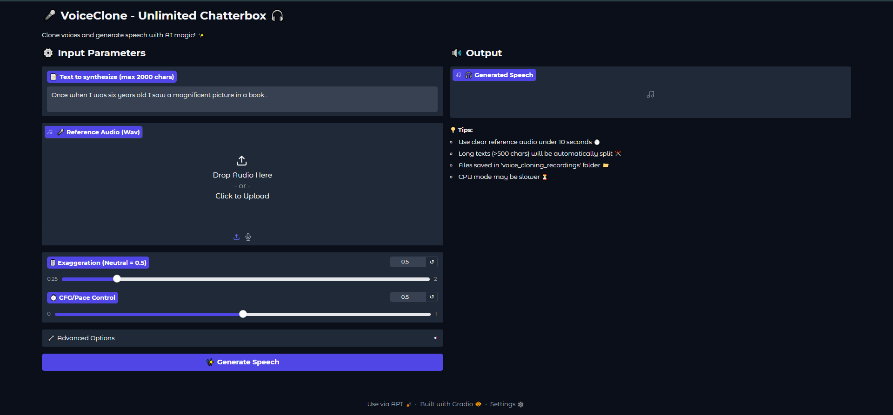

# 🎤 VoiceClone Desktop App

A fully offline GPT-TTS powered voice cloning desktop app built with **Python + Gradio + PyWebView**.

### Features
- Offline speech generation


### screenshots


### Run
```bash
pip install -r requirements.txt
python app.py


